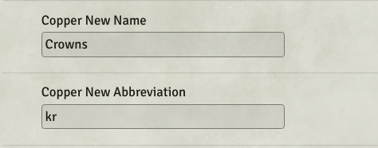
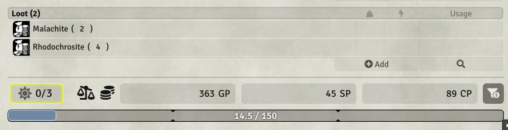
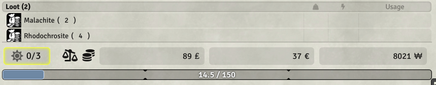
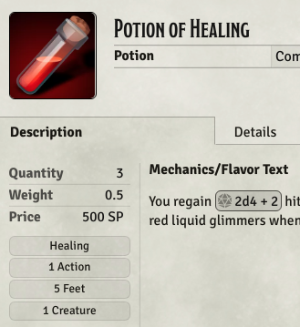
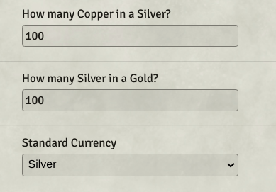
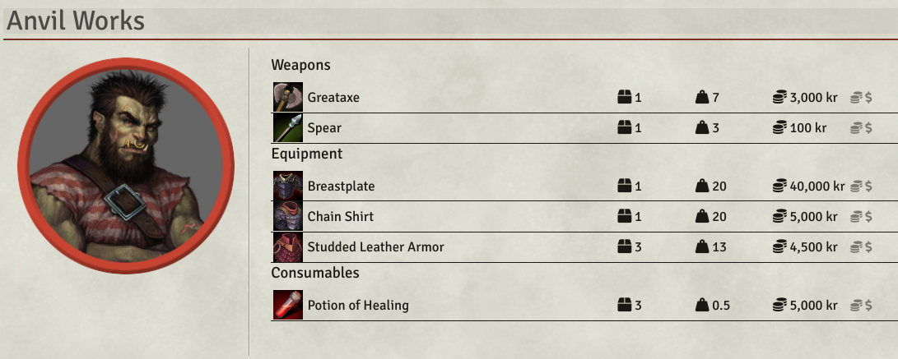

<h1 align="center">World Currency 5e module for Foundry VTT</h1>

 

This [FoundryVTT](https://foundryvtt.com) module allows you to use your world's homebrew currencies in D&D 5th Edition.

## Installation

1. On Foundry's "Add-on Modules" tab, click "Install Module"
2. At the bottom, paste `https://raw.githubusercontent.com/cstby/foundryvtt-world-currency-5e/master/module.json` into the "Manifest URL" field and click "install".

## Features

### Rename Currency

Rename currencies and their abbreviations. The new names and abbreviations will be used wherever the old names appeared.

### Hide Currency

Hide currencies that you don't want to use. If your players get confused by platinum and electrum, hide them and never think of them again!

### Hide Converter

If your currencies aren't meant to be interchangeable, you can hide the currency converter from the character sheets.

### Standard Currency

Set a standard currency. All items will be priced in that currency instead of gold. You and your players won't see any reference to gold or need to consider items prices in gold.

### Set Conversion Rates

Set whatever currency rates you need. Great for using the silver standard, which makes gold more rare.

### Merchant Sheet NPC Compatibility

When using the [Merchant Sheet NPC](https://github.com/whelan/fvtt-merchant-sheet-npc) module (recommended), merchants prices will be converted to your standard currency. Merchants will only use the standard currency when buying and selling. (The standard currency can be changed on the fly.)

## Examples

### Remove Electrum

#### Steps

- Uncheck "Hide Converter" setting
- Change the name and abbreviation of Electrum to "Silver" and "SP"
- Change the name and abbreviation of Silver to "Copper" and "CP"
- Check "Hide Copper" to true.

#### Result

Electrum will not appear anymore on character sheets. Using the currency converter and modules like Lazy Money will work as expected.

### Silver Standard

#### Steps

- Uncheck "hide converter" setting
- Rename platinum to gold
- Rename gold to silver
- Rename electrum to copper
- Hide Silver
- Hide Copper
- Keep standard currency as gold (which will show as silver if you already saved the above changes.)

#### Result

All items will be denominated in silver instead of gold. (Eg. a backpack is now 2 sp instead of 2 gp.) One silver is worth 100 copper. A gold is worth 100 silver. Players will only see gold, silver, and copper on their character sheets. The converter will work as expected.

### One Fiat Currency

#### Steps

- Hide platinum, gold, electrum, and silver
- Change the name and abbreviation to "Woolong" and "￦" (or whatever you prefer)
- Set all exchange rates to "1" and set the final one to 10,000 (or whatever you prefer)

#### Result

- Players will only have one currency box for Woolongs on their character sheets. A 2 gp backpack now appears as 20,000 ￦.

  

### Fiat Currencies for different Kingdoms

#### Steps

- Hide Platinum, gold, and electrum.
- Rename Silver to "Dragons" (or whatever you prefer)
- Rename Copper to "Suns" (or whatever you prefer)
- Set all exchange rates to 1 (or whatever you prefer)

#### Result

Only Dragons and Suns will be visible on the character sheets. A 2 gp backpack now costs 2 Dragons or 2 Suns. Players accumulate and spend these currencies independently. By default you have have fractions of currencies, so 2.31 Dragons would be tracked as expected.

## Compatibility

World Currencies 5e works by patching the currency names and rates set by the D&D 5e System. Any module that pulls names and rates from the D&D 5e System will display them correctly.

| **Name**                                                                                         |       Works        | Notes                                                                                                                               |
| ------------------------------------------------------------------------------------------------ | :----------------: | ----------------------------------------------------------------------------------------------------------------------------------- |
| [D&D 5e System](https://gitlab.com/foundrynet/dnd5e)                          | :heavy_check_mark: | Fully Compatible                                                                        |
| [Tidy5e Sheet](https://github.com/sdenec/tidy5e-sheet)                          | :heavy_check_mark: | Fully Compatible                                                       |
| [Party Overview](https://github.com/sdenec/tidy5e-sheet)                          | :heavy_check_mark: | Fully Compatible                                                                        |
| [Let's Trade 5e](https://github.com/KageJittai/lets-trade-5e)                          | :heavy_check_mark: | Fully Compatible                                                         |
| [Loot Sheet NPC 5e](https://github.com/jopeek/fvtt-loot-sheet-npc-5e)                          | :heavy_check_mark: | The loot sheet is fully compatible. Use Merchant Sheet NPC for merchants.                                                                        |
| [Merchant Sheet NPC](https://github.com/whelan/fvtt-merchant-sheet-npc)                          | :heavy_check_mark: | Fully compatible. Merchants will always use your standard currency.                                                                    |
| [Item Piles](https://github.com/fantasycalendar/FoundryVTT-ItemPiles)                          | :heavy_check_mark: | Fully compatible. Currencies can be hidden from within Item Piles settings.                                                              |
| [Lazy Money](https://github.com/whelan/fvtt-merchant-sheet-npc)                          | :warning: | Works, but it will convert to hidden currencies. If hiding currencies, only hide the lowest ones to maintain compatibility with Lazy Money.                                                    |

## Known Limitations

- Item prices can only be edited when the standard currency is gp. This is because the DND5e system assumes all items are priced in gold.

## Contributing

If you run into anything unexpected or have an idea for a new feature, please [submit an issue](https://github.com/cstby/world-currency-5e/issues). Merge requests are more than welcome.

## Acknowledgements

Many thanks to:

- [ktrieun](https://github.com/ktrieun) for making the original exchange rates module from which this one is forked.
- [League of Extraordinary FoundryVTT Developers](https://forums.forge-vtt.com/c/package-development/11) community for all their help and support.

## License

This Foundry VTT module is licensed under [GNU GPLv3.0](https://www.gnu.org/licenses/gpl-3.0.en.html), supplemented by [Commons Clause](https://commonsclause.com/).

This work is licensed under Foundry Virtual Tabletop [EULA - Limited License Agreement for module development from May 29, 2020.](https://foundryvtt.com/article/license/)

